# Toby's Music Journal
### Module 2 Assignment for RevoU FSSE Amsterdam
#### By Tobias Agyasta (Team 2)

[**View website using custom domain**](https://tobiashalomoan.site/)

## How to Open

In order to open the website, you can open the deployed website in the custom domain above. 

In order to deploy from Github to Netlify, and connect my project to a custom domain, here are the steps that I took:
### Deploying through Netlify and Connecting a Custom Domain
1. With my Github account, I signed up to [Netlify](https://app.netlify.com/signup), a development platform used to build and deploy websites.

<kbd>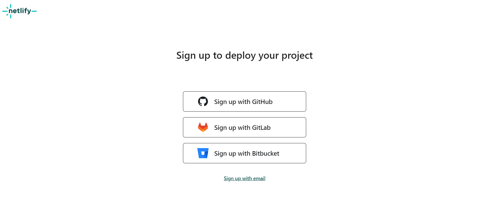</kbd>

2. After logging in, I selected the **Add new site** option and selected **Import an existing project**

<kbd>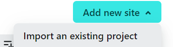</kbd>

3. I select **Deploy with Github**

<kbd>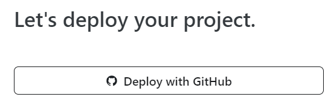</kbd>

4. Then, I selected the project repo to be deployed.

<kbd>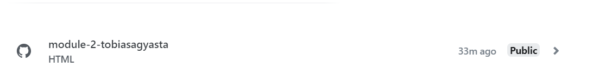</kbd>

5. I have enabled auto-deployment in Netlify, and the app will automatically deploy the website every time a new commit was pushed from me.

<kbd>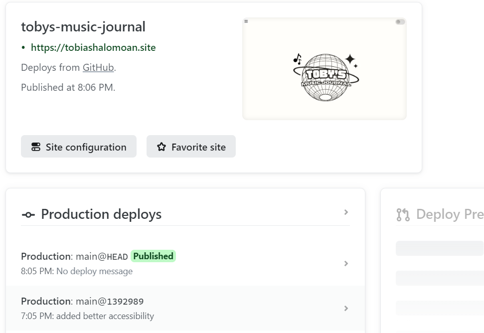</kbd>

6. Then, I went and bought my custom domain through [Niagahoster](https://www.niagahoster.co.id/domain-murah). In my case, I bought the domain: *tobiashalomoan.site*

<kbd>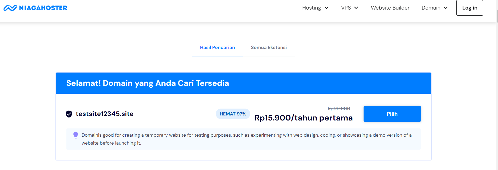</kbd>

7. I went to my Netlify account, and selected the **Domains** option, and chose **Add a Domain**

<kbd>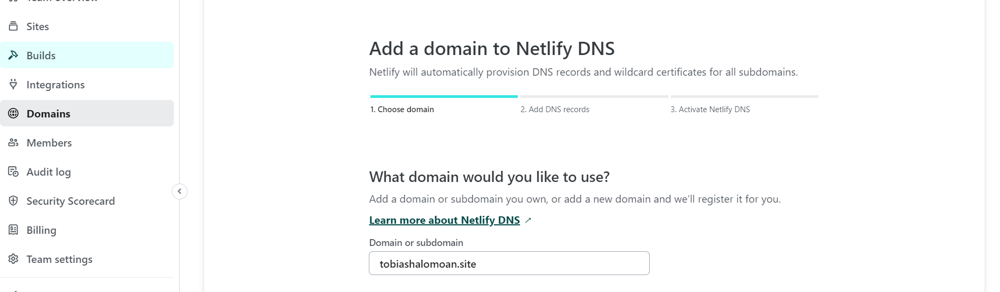</kbd>

8. After linking the Netlify project to the custom domain, it will show this progress, with the warning *Awaiting external DNS*

<kbd>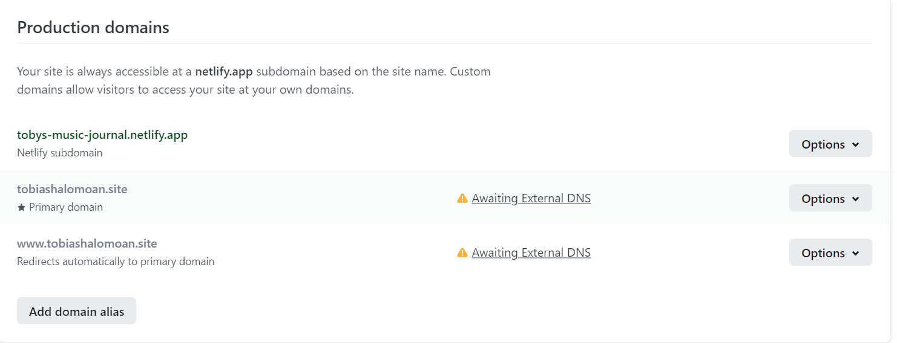</kbd>

9. In order to properly configure the netlify deployment and the custom domain, the DNS of the custom domain from the Niagahoster hosting providers needs to be pointed to Netlify's name servers

<kbd>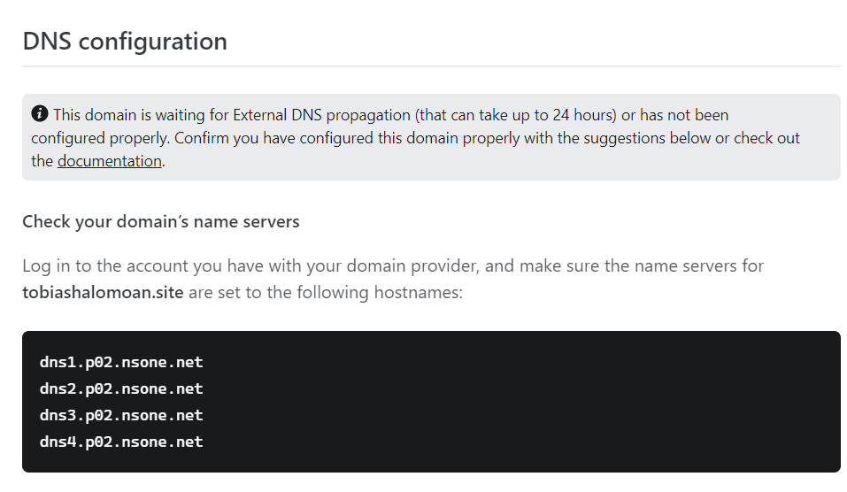</kbd>

10. So, I went to my Domains page in Niagahoster, and changed my nameservers to the ones shown above.

<kbd>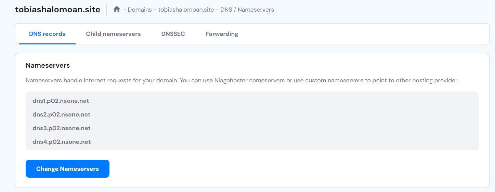</kbd>

11. After waiting for DNS propagation in ~20 minutes, the status of the domain in Netlify will change to the picture below. Now my Netlify deploys have finally been connected to a custom domain! :grin::grin:

<kbd>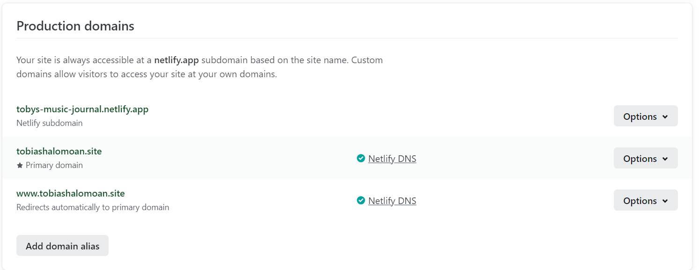</kbd>

## About

This is my submission for the Module 2 assignment. This is a website that serves as a blog on music appreciation and culture. 

In this website, I added a lot of customization as per what's required for the assignment, and will later add more content as per what's stated in the advanced portion of the assignment.

For the custom typeface in the website, I used [Epilogue](https://fonts.google.com/specimen/Epilogue) for the majority of the content, and [Aileron](https://www.dafontfree.io/aileron-font-family/) for the list items. Both fonts are stored locally.

For the content, most of the images that I used are taken from websites that I sourced.

For the news headline, I added some text-shadow as to make the text more readable.

The headline background image itself is responsive [^1], in which I used media query to alter the dimensions when the viewport is changed.

While most of the images were made responsive using media queries, I had one picture styled by using the picture + source + srcset method, replacing the original image with a smaller, cropped image in phone screens.

The whole website layout is done in grids, with each grid being put in flexbox column sections. 

In terms of animation, I used the animation method during the fading in of text and images, while transitions are mostly done in hover events. I used Javascript to use the IntersectionObserver API so I can execute animations whenever the viewport scrolls in view of the animated element.

In week two, I added a light/dark mode that sets a localStorage value in Javascript in order to save the mode whenever a user opens the website after the first time.

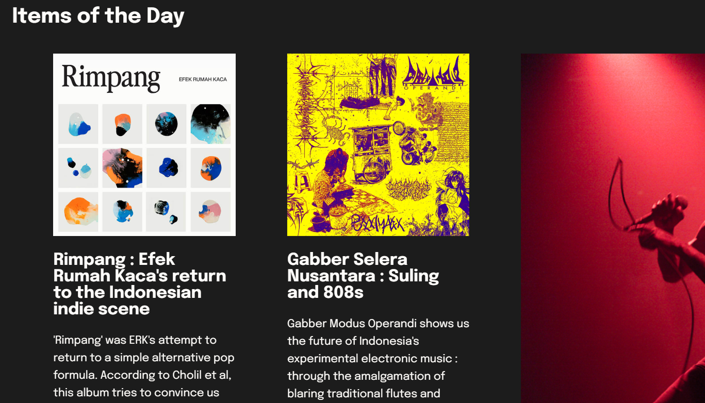

I also added a nice image carousel with only HTML and CSS.

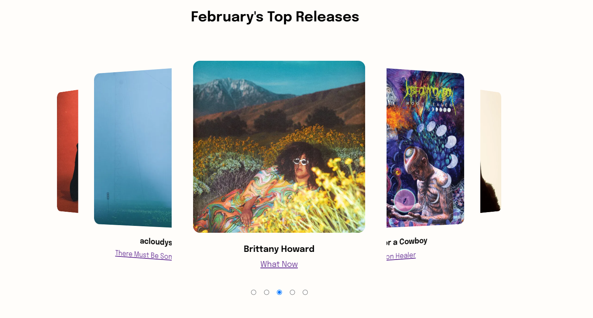

This website was designed with the maximum of accessibility. It receives an accessibility rating of 91 :

and SEO rating of 92 :

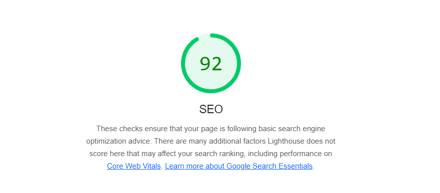

This analysis was done using [Google Lighthouse](https://developer.chrome.com/docs/lighthouse/overview) web extension

[^1]: The dimensions I picked for the responsive design is by using the 'iPhone 14 Pro Max' template, with dimensions of 430 x 932 pixels.
